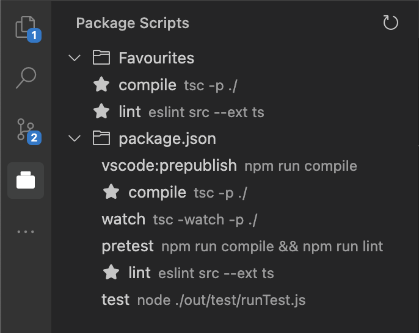

# Package Scripts Viewer

A VS Code extension that displays all package.json scripts from your workspace in a sidebar view, allowing you to easily run them with a single click.



## Features

- Displays all scripts from all package.json files in your workspace
- Shows scripts in a tree view in the Activity Bar
- Run scripts directly from the sidebar with a play button
- Auto-refreshes when package.json files are modified
- Works with monorepos and nested package.json files

## Usage

1. Open a workspace containing one or more package.json files
2. Click on the Package Scripts icon in the Activity Bar
3. View all available scripts from your workspace
4. Click the play button next to a script to run it in a terminal

## Installation

### Manual Installation (.vsix file)

If you have the `.vsix` file for this extension, you can install it manually:

1. Open VS Code
2. Go to the Extensions view by clicking on the Extensions icon in the Activity Bar or pressing `Ctrl+Shift+X`
3. Click on the ellipsis (...) at the top-right corner of the Extensions view
4. Select "Install from VSIX..." from the dropdown menu
5. Navigate to the location of your `.vsix` file, select it, and click "Install"

Alternatively, you can install the extension from the command line:

```bash
code --install-extension package-scripts-viewer-0.0.1.vsix
```

Note: Replace `package-scripts-viewer-0.0.1.vsix` with the actual filename of the extension if different.

## Requirements

- VS Code 1.60.0 or higher

## Extension Settings

This extension doesn't have any settings yet.

## Known Issues

None at this time.

## Release Notes

### 0.0.1

Initial release of Package Scripts Viewer
